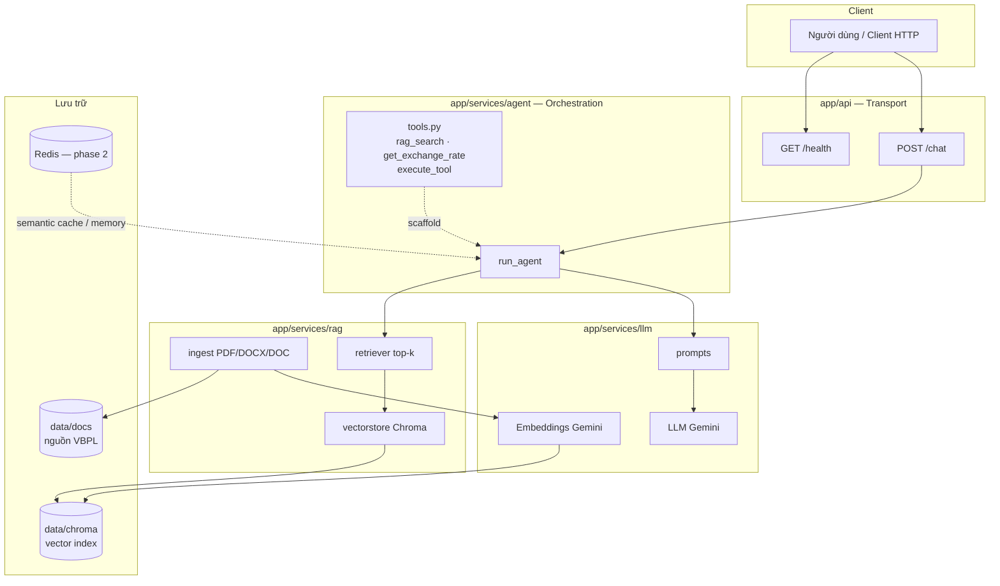
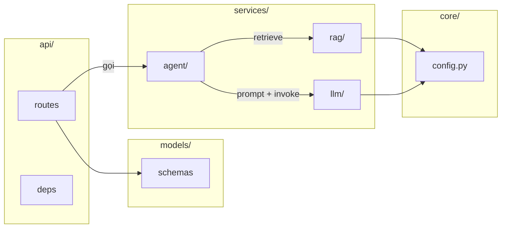
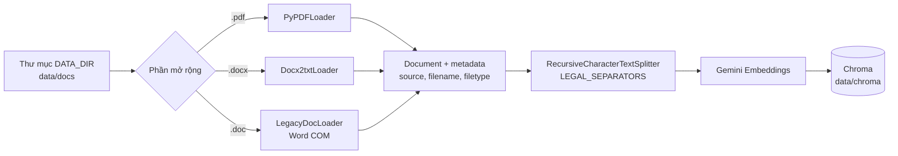
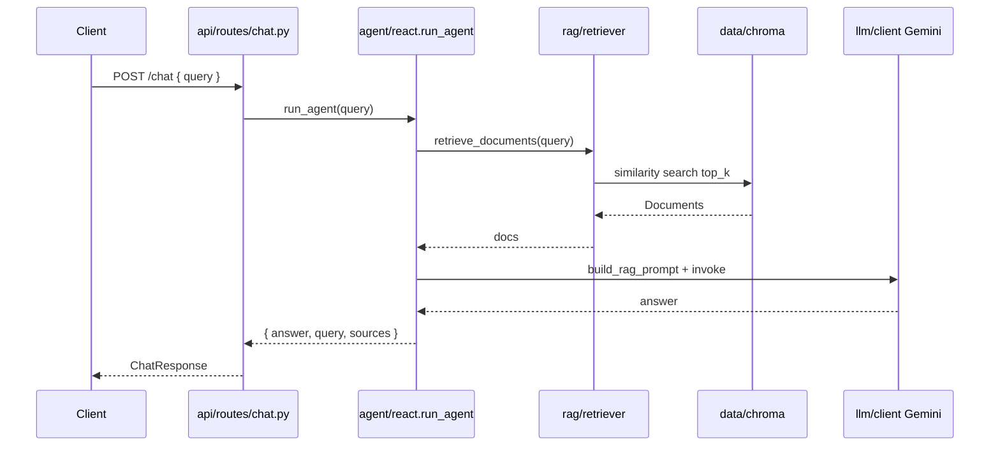
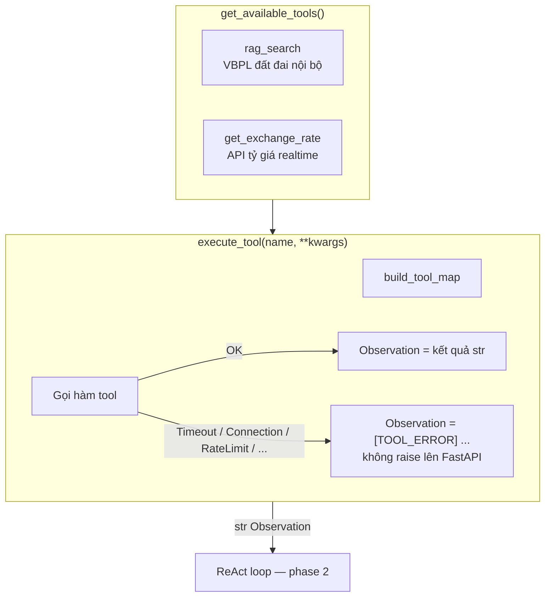
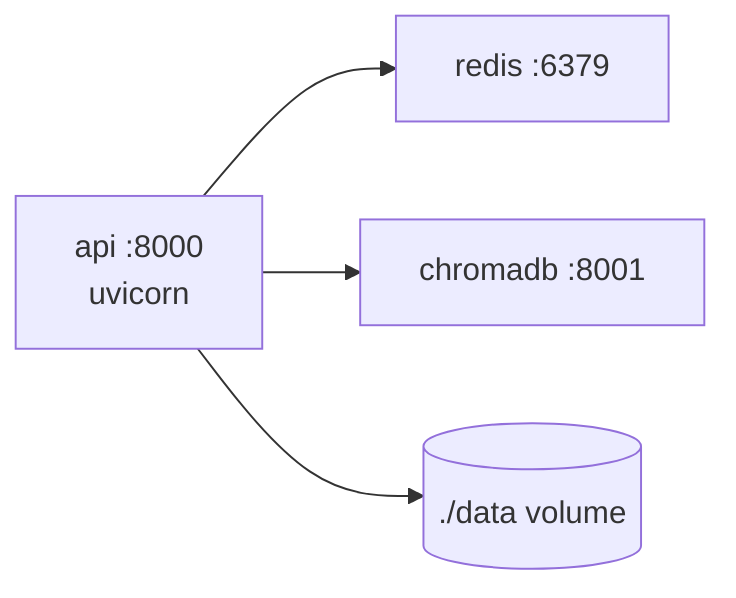
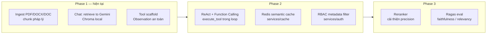

# Kiến trúc hệ thống — Advanced RAG Agent (Đất đai)

> Tài liệu kỹ thuật cho vận hành / phát triển.  
> Mục tiêu sản phẩm: agent trả lời kiến thức **quy định đất đai** dựa trên kho văn bản nội bộ, sẵn sàng mở rộng ReAct + tool ngoại vi.

**Trạng thái:** Phase 1 runtime đã chạy; Phase 2 (ReAct loop đầy đủ, Redis semantic cache, RBAC) đang scaffold / thiết kế.

---

## 1. Tổng quan hệ thống

Hệ thống là API FastAPI nhận câu hỏi, retrieve ngữ cảnh từ Chroma (đã ingest văn bản pháp luật), rồi sinh câu trả lời bằng Gemini.



| Thành phần | Vai trò | Trạng thái |
|------------|---------|------------|
| FastAPI (`/health`, `/chat`) | HTTP, thin wrapper | ✅ |
| Agent `run_agent` | Orchestrate retrieve → prompt → LLM | ✅ (pipeline thẳng) |
| RAG ingest | Load, chunk pháp lý, embed, persist Chroma | ✅ |
| RAG retrieve | Similarity search top-k | ✅ |
| Gemini LLM + embeddings | Sinh câu trả lời / vector | ✅ |
| Tools + `execute_tool` | Metadata tool + Observation an toàn khi lỗi | ✅ scaffold |
| ReAct loop đầy đủ | Thought → Action → Observation lặp | 🔲 phase 2 |
| Redis semantic cache | Cache câu hỏi tương tự | 🔲 thiết kế |
| RBAC metadata filter | Pre-filter theo role | 🔲 thiết kế |

---

## 2. Cấu trúc thư mục & Separation of Concerns



| Thư mục | Trách nhiệm | Không làm |
|---------|-------------|-----------|
| `app/api` | HTTP, validate request/response | Business RAG / LLM |
| `app/core` | Settings từ `.env` | Logic nghiệp vụ |
| `app/models` | Pydantic schemas | I/O DB / LLM |
| `app/services/rag` | Ingest, chunk, Chroma, retrieve | Chọn tool / HTTP |
| `app/services/agent` | Orchestration, tool metadata, an toàn tool | Chi tiết embedding |
| `app/services/llm` | Client Gemini, prompts | Routing HTTP |
| `eval/` | Ragas scaffold | Runtime API |
| `data/docs` | Tài liệu nguồn | — |
| `data/chroma` | Index vector (gitignore) | — |

**Vị trí thiết kế (chưa code đầy đủ) — SoC đã chốt:**

| Concern | Đặt tại |
|---------|---------|
| Semantic Cache (Redis) | `services/cache/semantic.py` + `core/redis.py` |
| RBAC → metadata filter | `services/auth/rbac.py`; identity ở `api/deps.py` |
| Apply `where` lúc retrieve | `services/rag/retriever.py` (nhận filter, không biết role) |

---

## 3. Pipeline ingest (đã triển khai)

Nguồn: `.pdf` / `.docx` / `.doc` (Windows COM cho `.doc`) → chunk theo cấu trúc pháp lý → embedding → Chroma.



**API ingest chính:**

| Hàm | Mô tả |
|-----|--------|
| `ingest_file(path)` | Một file theo suffix |
| `ingest_directory(dir?)` | Đệ quy PDF + DOCX + DOC |
| `get_legal_text_splitter()` | Separators: Chương → Mục → Điều → Khoản → điểm |

**Tham số mặc định:** `chunk_size=1000`, `chunk_overlap=200` (`app/core/config.py`).

---

## 4. Luồng runtime `/chat` (Phase 1 — đang chạy)



**Lưu ý:** Phase 1 gọi retrieve trực tiếp trong `run_agent`, chưa qua ReAct / Function Calling. Tool `rag_search` đã khai báo để phase 2 gắn vào loop.

---

## 5. Agent Tools & an toàn Observation (scaffold)



**Hợp đồng Observation khi lỗi** (do `format_tool_error_observation`):

```text
[TOOL_ERROR] tool=<name> type=<Timeout|RateLimit|ConnectionError|...>
message=<chi tiết rút gọn ≤300 ký tự>
hint=... Agent tự xử lý tiếp, không crash API ...
```

Nguyên tắc: **lỗi tool ≠ lỗi HTTP 500**. Chỉ orchestration / LLM hệ thống mới được bubble lên `chat.py`.

---

## 6. Hạ tầng Docker Compose



| Service | Port | Mục đích |
|---------|------|----------|
| `api` | 8000 | FastAPI |
| `redis` | 6379 | Memory / semantic cache (phase 2) |
| `chromadb` | 8001 | Vector DB server (hiện ingest vẫn dùng local persist `data/chroma`) |

---

## 7. API & cấu hình

| Method | Path | Body / Response |
|--------|------|-----------------|
| `GET` | `/health` | `{ status, version }` |
| `POST` | `/chat` | `ChatRequest` → `ChatResponse` |

**Biến môi trường chính** (xem `.env.example`):

- `GOOGLE_API_KEY`, `GOOGLE_MODEL`, `EMBEDDING_MODEL`
- `CHROMA_PERSIST_DIR`, `DATA_DIR`
- `CHUNK_SIZE`, `CHUNK_OVERLAP`, `TOP_K`
- `REDIS_URL` (phase 2)

---

## 8. Lộ trình



---

## 9. Tài liệu liên quan

| File | Đối tượng |
|------|-----------|
| [architecture.md](./architecture.md) | Hệ thống (tài liệu này) |
| [learning-guide.md](./learning-guide.md) | Học tập / onboarding khái niệm |
| [../README.md](../README.md) | Setup nhanh |

---

*Cập nhật theo codebase hiện tại. Khi ReAct loop / cache / RBAC được merge, bổ sung mục tương ứng vào sơ đồ runtime.*
