# Kiến trúc hệ thống — Advanced RAG Agent (Đất đai)

> Tài liệu kỹ thuật cho vận hành / phát triển.  
> Mục tiêu sản phẩm: agent trả lời kiến thức **quy định đất đai** dựa trên kho văn bản nội bộ, sẵn sàng mở rộng ReAct + tool ngoại vi.

**Trạng thái:** Phase 1–2 runtime đã chạy (ReAct + Redis semantic cache + RBAC); Phase 3 (Rerank, Ragas) đang scaffold / thiết kế theo đặc tả dưới đây.

Tài liệu học tập: [learning-guide.md](./learning-guide.md).

---

## 0. Tech stack

| Lớp | Công nghệ | Vai trò |
|-----|-----------|---------|
| Runtime | Python ≥ 3.11 | Ngôn ngữ chính |
| Package / env | **uv** (khuyến nghị) hoặc pip | Cài dependency, venv |
| Orchestration LLM | **LangChain** (+ text-splitters, community loaders) | Ingest, retrieve, tool wiring |
| Vector DB | **ChromaDB** | Lưu embedding + metadata filter |
| LLM / Embedding | **Google Gemini** (Flash family; cấu hình qua `.env`) | Sinh câu trả lời + embed |
| API | **FastAPI** + Uvicorn | HTTP `/health`, `/chat` |
| Cache / memory | **Redis** | Semantic cache + session (phase 2) |
| Đóng gói | **Docker Compose** | `api` + `redis` + `chromadb` |
| Đánh giá | **Ragas** (LLM-as-a-judge) | Faithfulness / chống hallucination |

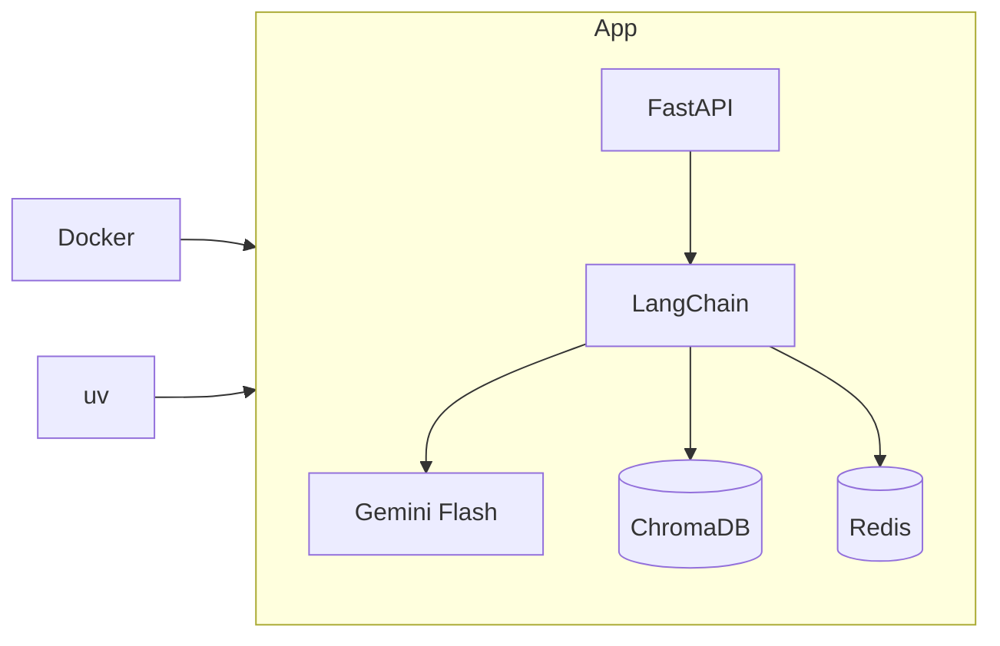

---

## 1. Tổng quan hệ thống

Hệ thống là API FastAPI nhận câu hỏi: kiểm tra semantic cache → RBAC filter → ReAct agent (tool-calling) → Observation → câu trả lời Gemini. Phase 3 bổ sung rerank + Ragas.

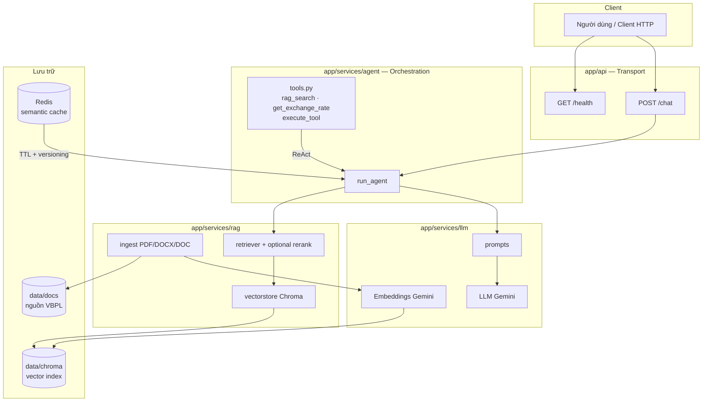

| Thành phần | Vai trò | Trạng thái |
|------------|---------|------------|
| FastAPI (`/health`, `/chat`) | HTTP, thin wrapper | ✅ |
| Agent `run_agent` | ReAct loop + tool-calling | ✅ |
| RAG ingest | Load, chunk pháp lý, embed, persist Chroma | ✅ |
| RAG retrieve | Similarity search top-k (+ metadata `where`) | ✅ |
| Gemini LLM + embeddings | Sinh câu trả lời / vector | ✅ |
| Tools + `execute_tool` | Metadata tool + Observation an toàn khi lỗi | ✅ |
| ReAct loop đầy đủ | Thought → Action → Observation lặp | ✅ |
| Redis semantic cache | TTL + versioning, chặn câu hỏi lặp | ✅ |
| RBAC metadata filter | Pre-filter `where` trong Chroma | ✅ |
| Reranking | Lấy ~20 chunk → giữ top 5 | 🔲 phase 3 |
| Ragas Faithfulness | LLM-as-a-judge, kiểm soát hallucination | 🔲 phase 3 |

---

## 2. Cấu trúc thư mục & Separation of Concerns

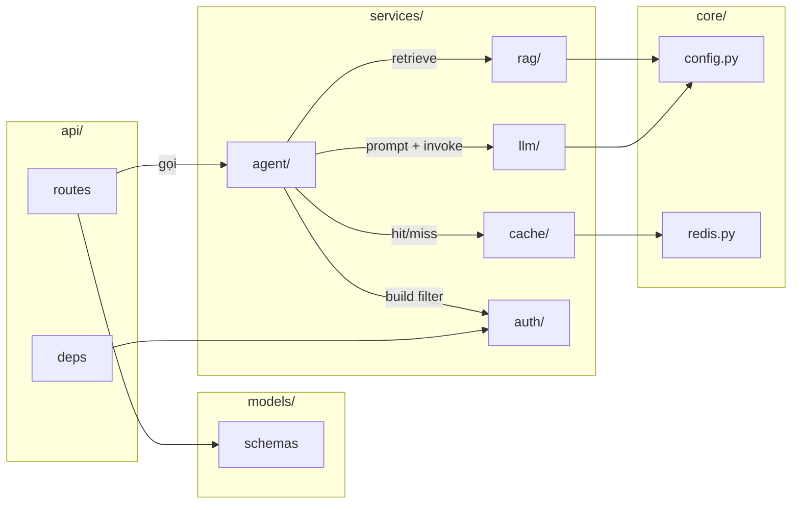

| Thư mục | Trách nhiệm | Không làm |
|---------|-------------|-----------|
| `app/api` | HTTP, validate request/response | Business RAG / LLM |
| `app/core` | Settings `.env`, Redis client | Logic nghiệp vụ |
| `app/models` | Pydantic schemas | I/O DB / LLM |
| `app/services/rag` | Ingest, chunk, Chroma, retrieve, rerank | Chọn tool / HTTP |
| `app/services/agent` | Orchestration, tool metadata, an toàn tool | Chi tiết embedding |
| `app/services/llm` | Client Gemini, prompts | Routing HTTP |
| `app/services/cache` | Semantic cache Redis | Gọi Chroma / LLM sinh câu |
| `app/services/auth` | Role → metadata filter RBAC | Query vector |
| `eval/` | Ragas (Faithfulness, …) | Runtime API |
| `data/docs` | Tài liệu nguồn | — |
| `data/chroma` | Index vector (gitignore) | — |

**Vị trí thiết kế — SoC đã chốt:**

| Concern | Đặt tại |
|---------|---------|
| Semantic Cache (Redis + TTL/version) | `services/cache/semantic.py` + `core/redis.py` |
| RBAC → metadata filter | `services/auth/rbac.py`; identity ở `api/deps.py` |
| Apply `where` lúc retrieve | `services/rag/retriever.py` (nhận filter, không biết role) |
| Reranker | `services/rag/rerank.py` (nhận candidates, trả top-n) |

---

## 3. Dữ liệu & lưu trữ (pipeline)

Chuỗi chuẩn:

**RecursiveCharacterTextSplitter (có overlap) → Embedding (Gemini) → ChromaDB**

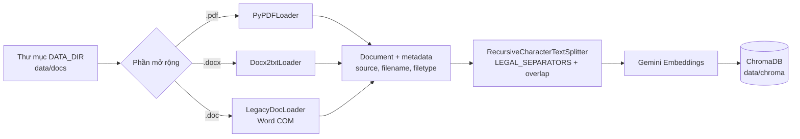

**API ingest chính:**

| Hàm | Mô tả |
|-----|--------|
| `ingest_file(path)` | Một file theo suffix |
| `ingest_directory(dir?)` | Đệ quy PDF + DOCX + DOC |
| `get_legal_text_splitter()` | Separators: Chương → Mục → Điều → Khoản → điểm |

**Tham số mặc định:** `chunk_size=1000`, `chunk_overlap=200` (`app/core/config.py`).

Overlap giữ ngữ cảnh biên giữa hai chunk; separators pháp lý tránh cắt giữa `Điều` / `Khoản`.

---

## 4. Luồng runtime `/chat` (Phase 2 — đang chạy)

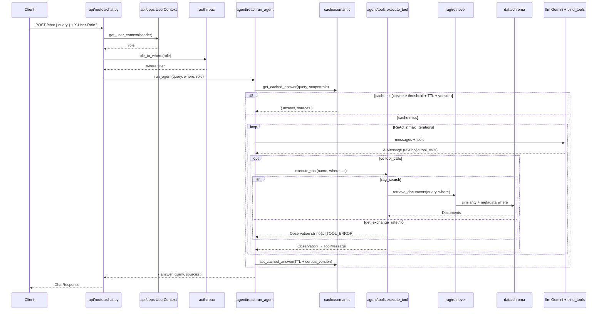

**Điểm chốt Phase 2:**

| Lớp | Hành vi |
|-----|---------|
| Header `X-User-Role` | `citizen` \| `staff` \| `legal_staff` (mặc định `citizen`) |
| RBAC | `role_to_where` → `{"audience": {"$in": [...]}}` truyền vào `rag_search` |
| Semantic cache | Cosine embedding + `CACHE_SIMILARITY_THRESHOLD` + `CORPUS_VERSION` + scope theo role |
| ReAct | `bind_tools` → `rag_search` / `get_exchange_rate` qua `execute_tool` |
| Rerank | Chưa — Phase 3 |

**Luồng mục tiêu Phase 3** (bổ sung rerank sau retrieve rộng):

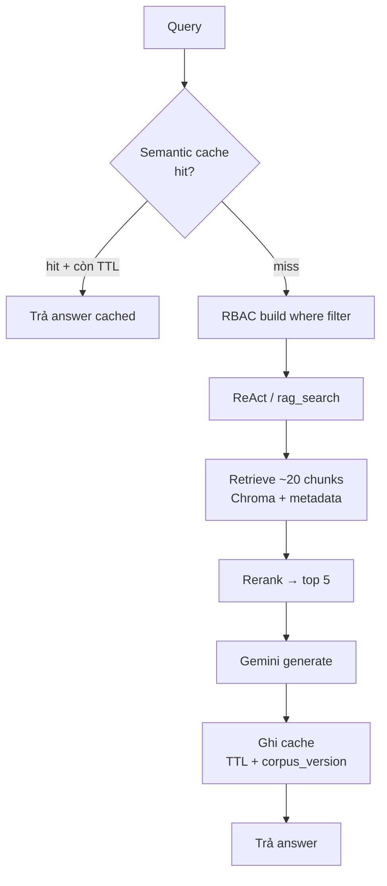

---

## 5. Agent Tools & an toàn Observation

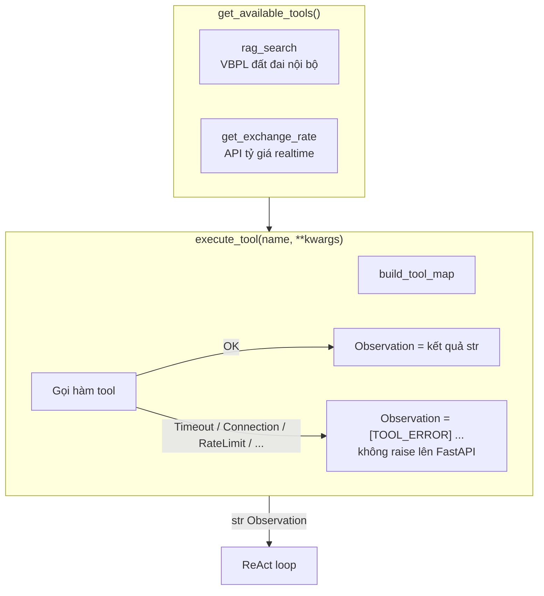

**Hợp đồng Observation khi lỗi** (do `format_tool_error_observation`):

```text
[TOOL_ERROR] tool=<name> type=<Timeout|RateLimit|ConnectionError|...>
message=<chi tiết rút gọn ≤300 ký tự>
hint=... Agent tự xử lý tiếp, không crash API ...
```

Nguyên tắc: **lỗi tool ≠ lỗi HTTP 500**. Chỉ orchestration / LLM hệ thống mới được bubble lên `chat.py`.

Agent dùng **ReAct loop + Function Calling**; tool ngoại vi (ví dụ tỷ giá) luôn đi qua `execute_tool` (try/except → Observation).

---

## 6. Tối ưu & mở rộng

### 6.1 Semantic Cache (Redis + TTL + Versioning)

**Mục tiêu:** chặn câu hỏi lặp / gần nghĩa → giảm gọi retrieve + LLM, giảm tải hệ thống.

| Thành phần | Mô tả |
|------------|--------|
| Key | Embedding của query (hoặc hash gần đúng) + `corpus_version` |
| Value | `answer` (+ optional `sources`) đã serialize |
| TTL | Hết hạn tự động (ví dụ 1h–24h, cấu hình `.env`) |
| Versioning | Khi re-ingest / đổi index → tăng `corpus_version` → cache cũ coi như miss |

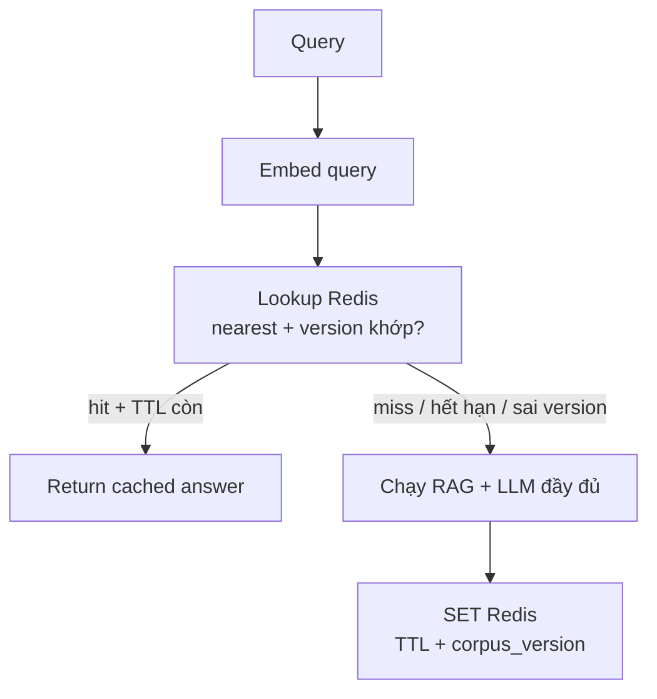

**File đã có:** `app/services/cache/semantic.py`, client `app/core/redis.py`.

| Env | Mặc định | Ý nghĩa |
|-----|----------|---------|
| `REDIS_URL` | `redis://localhost:6379/0` | Kết nối Redis; lỗi/offline → bỏ qua cache |
| `CACHE_TTL_SECONDS` | `3600` | TTL entry + index set |
| `CORPUS_VERSION` | `1` | Tăng khi re-ingest / đổi index |
| `CACHE_SIMILARITY_THRESHOLD` | `0.92` | Ngưỡng cosine để coi là hit |

### 6.2 Reranking (20 → top 5)

**Mục tiêu:** retrieve rộng để không bỏ sót, rồi xếp hạng lại trước khi đưa vào prompt.

| Bước | Số lượng | Ý nghĩa |
|------|----------|---------|
| Retrieve | ~20 chunks | Recall cao |
| Rerank | giữ **top 5** | Precision cao, context gọn |

**Hiệu quả kỳ vọng (đặc tả sản phẩm):**

| Chỉ số | Ước lượng |
|--------|-----------|
| Giảm context đưa vào LLM | ~**75%** (20 → 5) |
| Tiết kiệm chi phí API | ~**65%** |
| Giảm latency | ~**20–35%** |

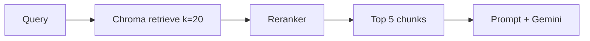

**File dự kiến:** `app/services/rag/rerank.py`; gọi từ retriever/agent sau similarity search.

### 6.3 Bảo mật — Metadata Pre-filtering (RBAC) trong ChromaDB

**Mục tiêu:** user chỉ retrieve được chunk thuộc phạm vi quyền — filter **ngay trong Chroma** (`where`), không lọc sau khi đã lấy hết.

Ví dụ metadata gắn lúc ingest:

| Field | Ví dụ giá trị |
|-------|----------------|
| `audience` | `public`, `internal`, `legal_staff` |
| `doc_level` | `law`, `decree`, `circular`, `guide` |
| `region` | `nationwide`, `province_x` |

Ví dụ: role `citizen` → `where = {"audience": {"$in": ["public"]}}`.

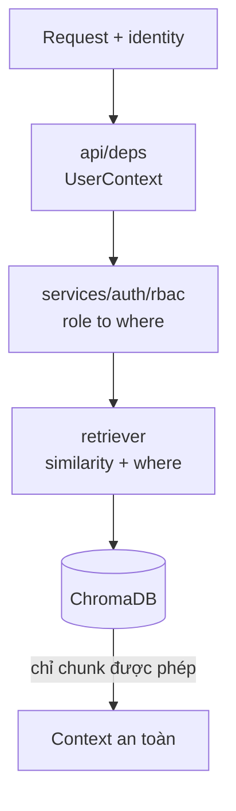

**SoC:** `auth` quyết định filter; `retriever` chỉ apply; không hard-code role trong Chroma query builder.

**Runtime:** `chat.py` → `role_to_where(user.role)` → `run_agent(..., where=..., role=...)`. Ingest mặc định gắn `audience=public`; tài liệu `internal` / `legal_staff` cần metadata tương ứng rồi re-ingest.

---

## 7. Đánh giá — Ragas (LLM-as-a-judge)

**Mục tiêu:** đo **Faithfulness** — câu trả lời có bám context đã retrieve không → kiểm soát **hallucination** (ảo giác điều/khoản).

| Khái niệm | Ý nghĩa |
|-----------|---------|
| LLM-as-a-judge | Model chấm điểm câu trả lời theo rubric / metric Ragas |
| Faithfulness | Claim trong answer có được hỗ trợ bởi context không |
| Eval offline | Chạy trên bộ hỏi–đáp mẫu trong `eval/` — không chặn request realtime |

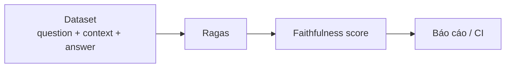

**Chạy (scaffold):** `python -m eval.run_ragas`  
**Phụ thuộc optional:** `.[eval]` trong `pyproject.toml`.

---

## 8. Hạ tầng Docker Compose

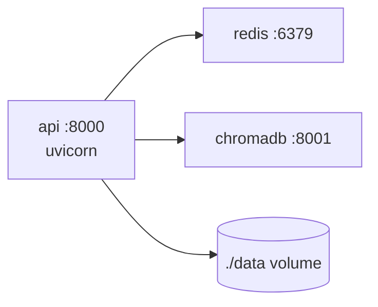

| Service | Port | Mục đích |
|---------|------|----------|
| `api` | 8000 | FastAPI |
| `redis` | 6379 | Semantic cache + memory (phase 2) |
| `chromadb` | 8001 | Vector DB server (hiện ingest vẫn dùng local persist `data/chroma`) |

---

## 9. API & cấu hình

| Method | Path | Body / Response |
|--------|------|-----------------|
| `GET` | `/health` | `{ status, version }` |
| `POST` | `/chat` | `ChatRequest` → `ChatResponse` |

**Biến môi trường chính** (xem `.env.example`):

- `GOOGLE_API_KEY`, `GOOGLE_MODEL`, `EMBEDDING_MODEL`
- `CHROMA_PERSIST_DIR`, `DATA_DIR`
- `CHUNK_SIZE`, `CHUNK_OVERLAP`, `TOP_K`
- `REDIS_URL`, `CACHE_TTL_SECONDS`, `CORPUS_VERSION`, `CACHE_SIMILARITY_THRESHOLD` (Phase 2)
- Header RBAC: `X-User-Role` (`citizen` \| `staff` \| `legal_staff`)
- *(Phase 3 dự kiến)* `RETRIEVE_K`, `RERANK_TOP_N`

---

## 10. Lộ trình

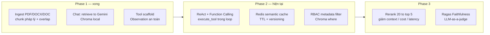

---

## 11. Tài liệu liên quan

| File | Đối tượng |
|------|-----------|
| [architecture.md](./architecture.md) | Hệ thống (tài liệu này) |
| [learning-guide.md](./learning-guide.md) | Học tập / onboarding khái niệm |
| [../README.md](../README.md) | Setup nhanh |

---

*Phase 2 đã merge (ReAct, Redis semantic cache, RBAC). Phase 3 (rerank KPI, Ragas Faithfulness) đang scaffold / thiết kế.*
