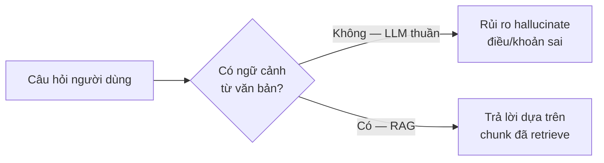
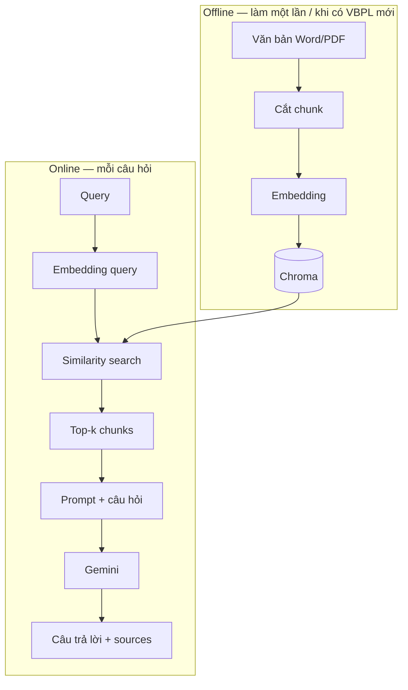
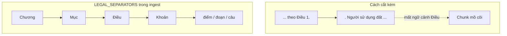
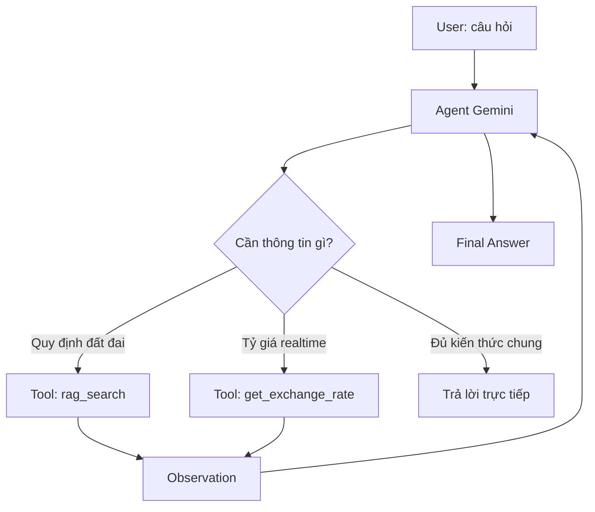
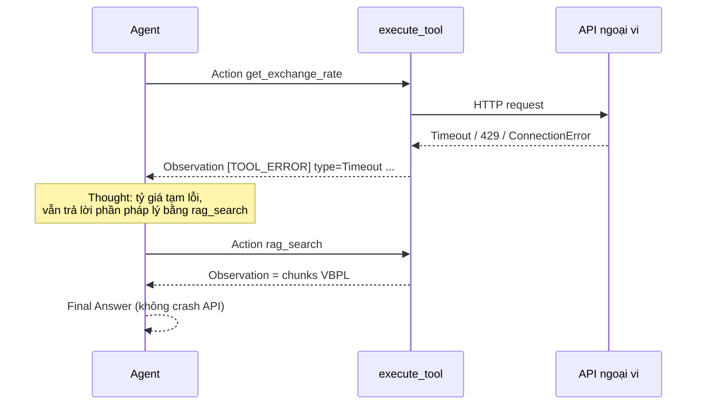
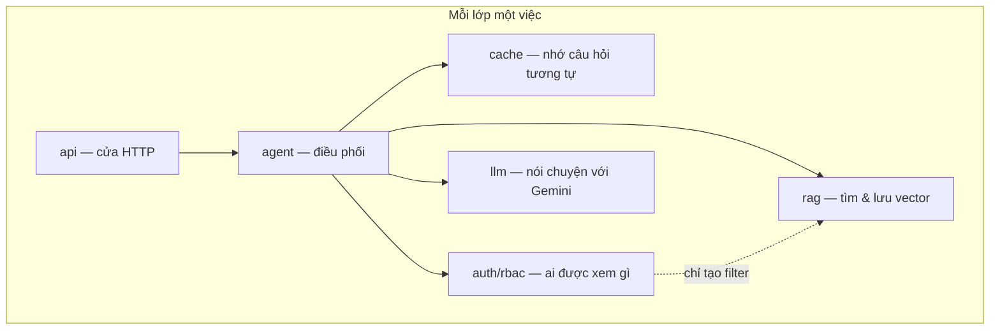
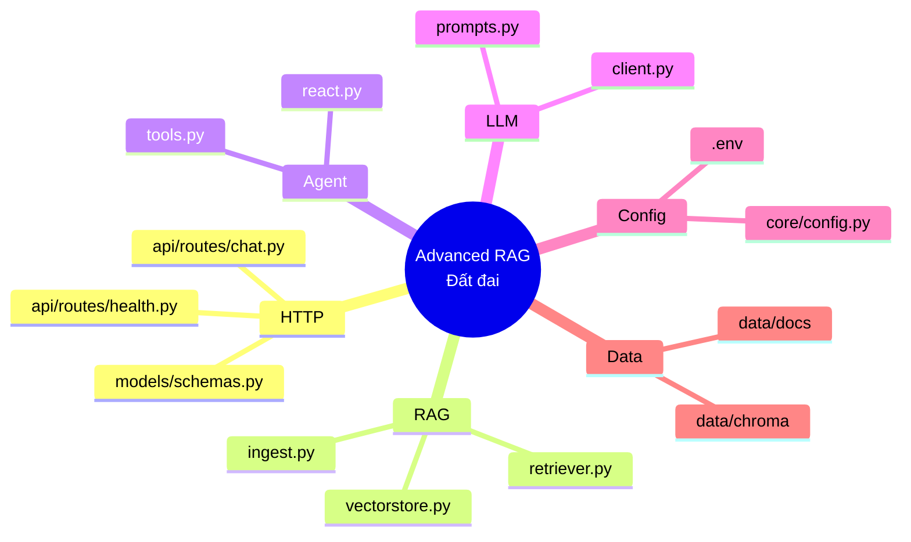

# Hướng dẫn học tập — Agent RAG quy định đất đai

> Tài liệu mang tính **học tập / onboarding**.  
> Đọc để hiểu *vì sao* hệ thống được thiết kế vậy, không phải sổ tay vận hành chi tiết.  
> Tài liệu hệ thống: [architecture.md](./architecture.md).

---

## 1. Bài toán đang giải

Người dùng hỏi về **quy định đất đai** (thu hồi, bồi thường, cấp GCN, chuyển mục đích…).  
LLM đơn thuần dễ bịa điều luật → cần **RAG**: lấy đoạn văn bản thật từ kho nội bộ rồi mới trả lời.

**Ý chính:** Agent không “biết luật” sẵn trong trọng số mô hình cho đủ độ tin cậy pháp lý; nó **tra cứu** kho đã index.

---

## 2. RAG là gì — nhìn bằng hình

**RAG = Retrieval-Augmented Generation**

1. **Retrieval:** tìm đoạn văn liên quan trong vector DB  
2. **Augmented:** nhét các đoạn đó vào prompt  
3. **Generation:** LLM viết câu trả lời dựa trên ngữ cảnh đó  

| Khái niệm | Trong project này |
|-----------|-------------------|
| Document | File Luật / NĐ / TT / hướng dẫn |
| Chunk | Đoạn text sau khi split (ưu tiên theo Điều/Khoản) |
| Embedding | Vector số từ Gemini embedding model |
| Vector store | Chroma tại `data/chroma` |
| top_k | Số chunk lấy về (mặc định 4) |

---

## 3. Vì sao văn bản pháp luật cần chunk đặc biệt?

Cắt theo dấu `.` dễ **xé giữa “Điều 1.”** → mất nghĩa pháp lý.

**Ghi nhớ học tập:** với VBPL, *thứ tự ưu tiên cắt* quan trọng hơn việc chỉnh `chunk_size` vài trăm ký tự.

---

## 4. Agent vs RAG thuần — lộ trình tư duy

**Phase 1 (đang chạy):** luôn retrieve rồi trả lời — đơn giản, ổn cho “chỉ hỏi luật”.

**Phase 2 (đang chuẩn bị):** Agent **tự chọn tool**:

- `rag_search` → kho đất đai nội bộ  
- `get_exchange_rate` → API ngoại vi (tỷ giá…)  

**Bài học:** *description* của tool là “hướng dẫn sử dụng” cho model. Hai tool cố ý **phủ định lẫn nhau** (RAG không dùng cho tỷ giá; tỷ giá không dùng cho VBPL) để giảm gọi nhầm.

---

## 5. ReAct + Observation khi tool lỗi

ReAct ≈ vòng lặp: **Reason (Thought) → Act (gọi tool) → Observe (đọc kết quả) → …**

Khi API tỷ giá timeout, **không được** để exception làm sập FastAPI. Thay vào đó trả **Observation lỗi** để Agent tự xử lý:

**Ba tầng lỗi cần tách trong đầu:**

| Tầng | Ví dụ | Xử lý đúng |
|------|--------|------------|
| Tool | Timeout tỷ giá | → Observation `[TOOL_ERROR]` |
| Agent | Hết số bước ReAct | → Trả lời lịch sự / partial |
| API HTTP | Bug code, LLM key sai | → HTTP 500 |

---

## 6. SoC — tách mối quan tâm (để học thiết kế)

**Câu hỏi kiểm tra hiểu biết:**

- Redis semantic cache có nên viết trong `chat.py` không? → **Không** (đặt `services/cache`).  
- RBAC có nên hard-code role trong `retriever.py` không? → **Không** (`auth` tạo filter; `retriever` chỉ apply).  
- Chroma có cần file PDF không? → **Không**; cần **text đã embed**. PDF/DOCX chỉ là nguồn ingest.

---

## 7. Bản đồ kiến thức ↔ file trong repo

---

## 8. Thực hành gợi ý (học bằng làm)

1. **Ingest:** bỏ vài file VBPL vào `DATA_DIR`, chạy `ingest_directory()`, xem số chunk.  
2. **Retrieve smoke:** hỏi một câu rõ Điều/Khoản, xem chunk trả về có đúng văn bản không.  
3. **Chat:** `POST /chat` — đối chiếu `sources` với file gốc.  
4. **Tool description:** đọc `RAG_SEARCH_DESCRIPTION` vs `EXCHANGE_RATE_DESCRIPTION` — thử tự viết description cho tool mới (ví dụ “tra cứu phí”).  
5. **Lỗi an toàn:** gọi `execute_tool("get_exchange_rate")` — phải nhận chuỗi `[TOOL_ERROR]`, không traceback ra client.

---

## 9. Thuật ngữ nhanh

| Thuật ngữ | Nghĩa ngắn |
|-----------|------------|
| Hallucination | Model bịa nội dung không có trong nguồn |
| Embedding | Biểu diễn vector của text để so độ tương đồng |
| Chunk overlap | Phần chồng giữa hai chunk để giữ ngữ cảnh biên |
| Function Calling | Model chọn hàm/tool kèm tham số có cấu trúc |
| Observation | Kết quả tool đưa lại vào vòng ReAct |
| Semantic cache | Cache theo độ giống nghĩa của câu hỏi (thường qua embedding) |
| Metadata pre-filter | Lọc chunk theo field metadata trước/ khi search (phục vụ RBAC) |

---

## 10. Đọc tiếp

1. [architecture.md](./architecture.md) — sơ đồ hệ thống, API, Docker, lộ trình phase  
2. [../README.md](../README.md) — cài đặt và chạy nhanh  
3. Code thực tế: `app/services/rag/ingest.py`, `app/services/agent/tools.py`

---

*Tài liệu học tập — ưu tiên trực quan và khái niệm. Chi tiết triển khai lấy từ codebase và architecture.md.*
