# Hướng dẫn học tập — Agent RAG quy định đất đai

> Tài liệu mang tính **học tập / onboarding**.  
> Đọc để hiểu *vì sao* hệ thống được thiết kế vậy, không phải sổ tay vận hành chi tiết.  
> Tài liệu hệ thống: [architecture.md](./architecture.md).

---

## 1. Bài toán đang giải

Người dùng hỏi về **quy định đất đai** (thu hồi, bồi thường, cấp GCN, chuyển mục đích…).  
LLM đơn thuần dễ bịa điều luật → cần **RAG**: lấy đoạn văn bản thật từ kho nội bộ rồi mới trả lời.

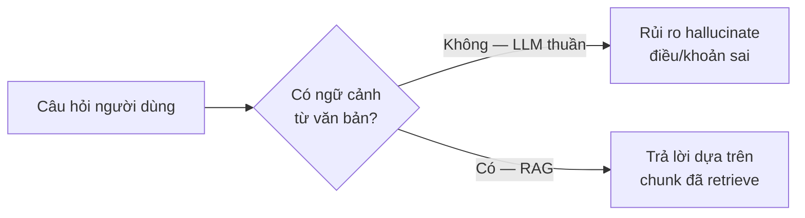

**Ý chính:** Agent không “biết luật” sẵn trong trọng số mô hình cho đủ độ tin cậy pháp lý; nó **tra cứu** kho đã index.

---

## 2. Stack cần nhớ (bức tranh lớn)

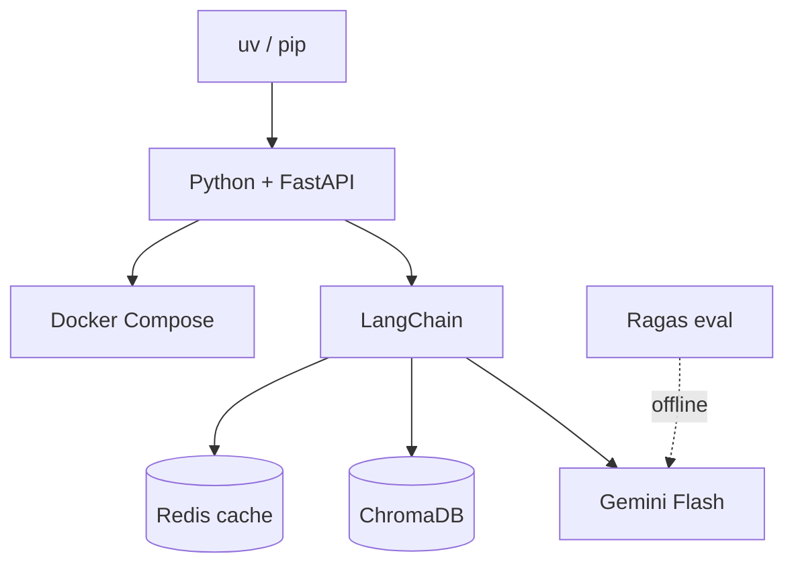

Không cần thuộc hết API: chỉ cần biết **ai làm việc gì** — FastAPI nhận request, LangChain nối RAG/tools, Chroma nhớ kiến thức, Redis nhớ câu hỏi lặp, Gemini viết câu trả lời, Ragas chấm độ trung thực.

---

## 3. RAG là gì — nhìn bằng hình

**RAG = Retrieval-Augmented Generation**

1. **Retrieval:** tìm đoạn văn liên quan trong vector DB  
2. **Augmented:** nhét các đoạn đó vào prompt  
3. **Generation:** LLM viết câu trả lời dựa trên ngữ cảnh đó  

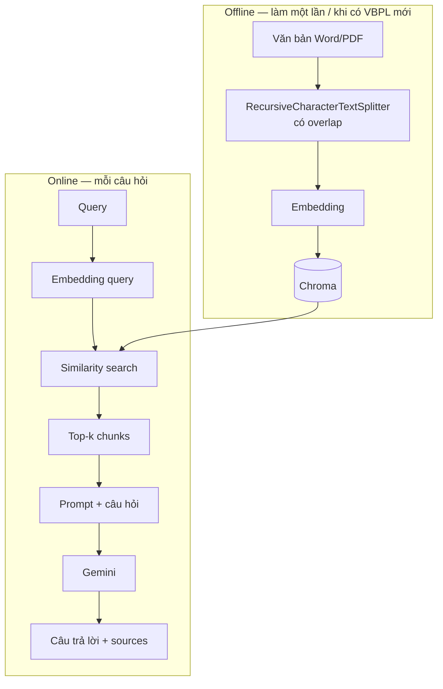

| Khái niệm | Trong project này |
|-----------|-------------------|
| Document | File Luật / NĐ / TT / hướng dẫn |
| Chunk | Đoạn text sau khi split (ưu tiên theo Điều/Khoản) |
| Overlap | Phần chồng giữa hai chunk — tránh mất câu ở biên |
| Embedding | Vector số từ Gemini embedding model |
| Vector store | Chroma tại `data/chroma` |
| top_k | Số chunk lấy về (mặc định 4; Phase 3 sẽ retrieve rộng rồi rerank) |

---

## 4. Vì sao văn bản pháp luật cần chunk đặc biệt?

Cắt theo dấu `.` dễ **xé giữa “Điều 1.”** → mất nghĩa pháp lý.

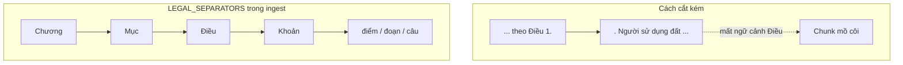

**Ghi nhớ học tập:** với VBPL, *thứ tự ưu tiên cắt* quan trọng hơn việc chỉnh `chunk_size` vài trăm ký tự. Overlap vẫn cần để “dính” biên Điều dài.

---

## 5. Agent vs RAG thuần — lộ trình tư duy

**Phase 1 (nền tảng):** luôn retrieve rồi trả lời — đơn giản, ổn cho “chỉ hỏi luật”.

**Phase 2 (đã chạy):** Agent **tự chọn tool** (ReAct + Function Calling):

- `rag_search` → kho đất đai nội bộ  
- `get_exchange_rate` → API ngoại vi (tỷ giá…)  

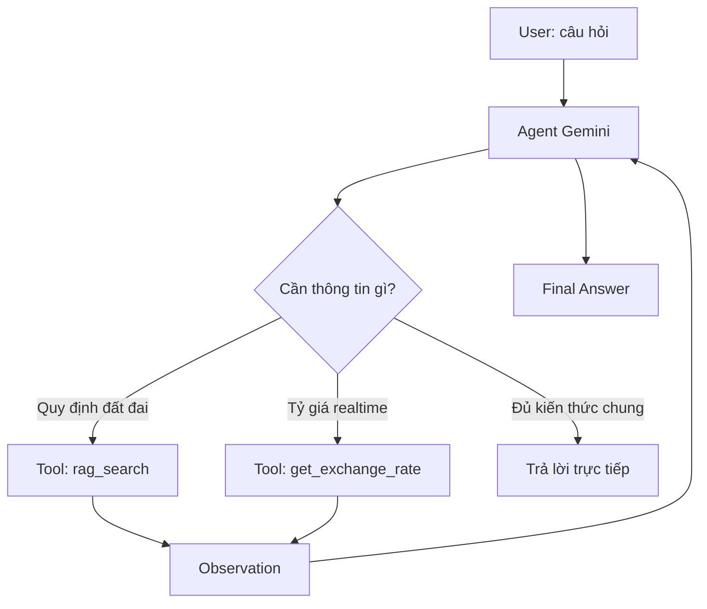

**Bài học:** *description* của tool là “hướng dẫn sử dụng” cho model. Hai tool cố ý **phủ định lẫn nhau** để giảm gọi nhầm.

---

## 6. ReAct + Observation khi tool lỗi

ReAct ≈ vòng lặp: **Reason → Act → Observe → …**

Khi API tỷ giá timeout, **không** để exception làm sập FastAPI — trả **Observation lỗi** (`execute_tool` + try/except):

| Tầng | Ví dụ | Xử lý đúng |
|------|--------|------------|
| Tool | Timeout tỷ giá | → Observation `[TOOL_ERROR]` |
| Agent | Hết số bước ReAct | → Trả lời lịch sự / partial |
| API HTTP | Bug code, LLM key sai | → HTTP 500 |

---

## 7. Semantic Cache — vì sao cần TTL và Versioning?

Câu hỏi lặp (“thu hồi đất được bồi thường thế nào?”) không nên mỗi lần đều gọi đủ retrieve + LLM.

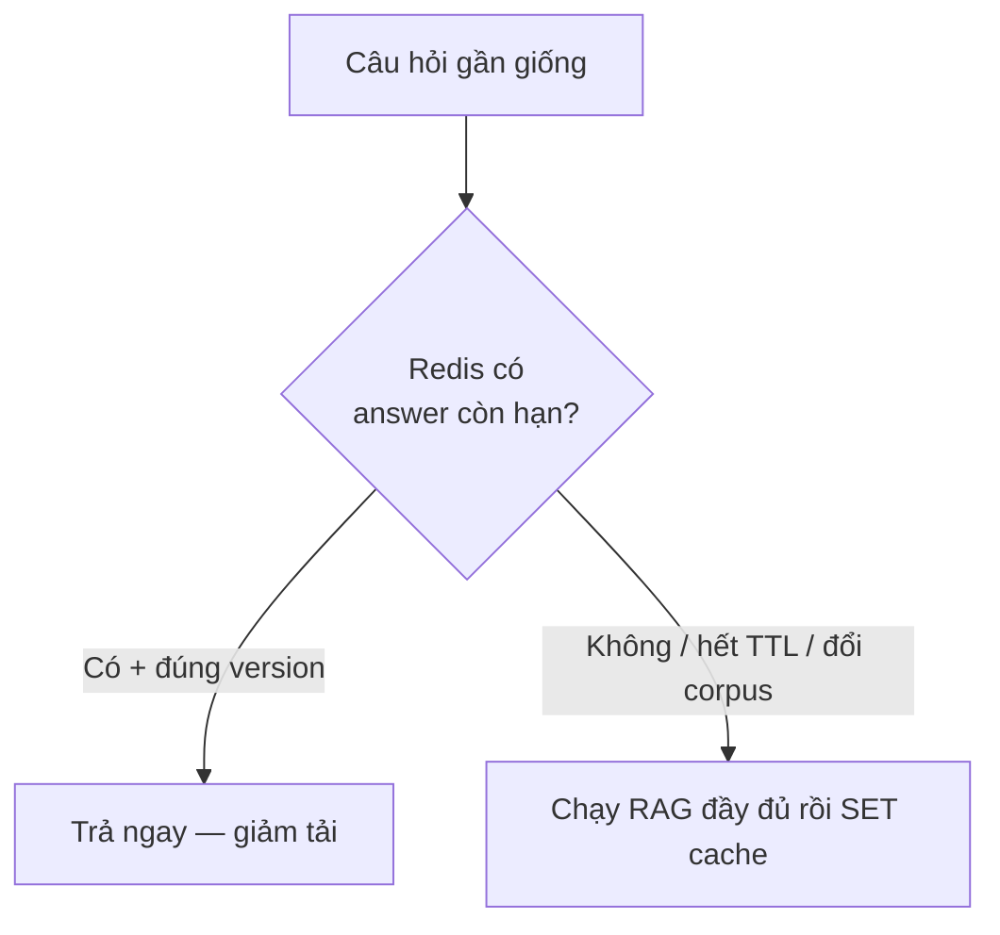

| Ý tưởng | Học gì từ đó |
|---------|----------------|
| **Semantic** | So theo *nghĩa* (embedding), không chỉ chuỗi ký tự giống hệt |
| **TTL** | Kiến thức / tỷ giá / chính sách có “tuổi thọ” — hết hạn thì tính lại |
| **Versioning** | Sau khi ingest lại VBPL, tăng version → tránh trả answer cũ dựa index cũ |

Chi tiết kỹ thuật: [architecture.md §6.1](./architecture.md).

---

## 8. Reranking — lấy nhiều rồi lọc ít

Similarity search giỏi **recall** (không bỏ sót) nhưng prompt dài thì đắt và nhiễu.

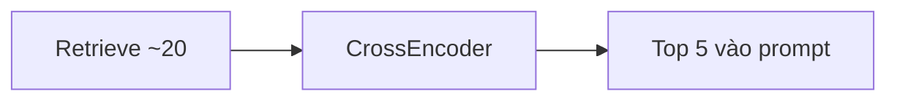

**Hình dung:** đọc 20 trang nháp → chỉ giữ 5 đoạn thật sự khớp câu hỏi.  
Thuật toán trong project: **cross-encoder local** (`sentence-transformers`) — chấm từng cặp (query, chunk), không tốn quota Gemini embed.  
Đặc tả kỳ vọng: giảm ~75% context, ~65% chi phí API generate (xem architecture).

---

## 9. RBAC bằng Metadata Pre-filtering

Không phải “lấy hết rồi che”. Chroma nhận `where` **trước / khi** search → chunk ngoài quyền không lọt vào context.

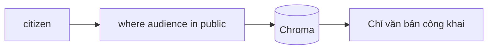

Học SoC: `deps` biết *ai*; `rbac` biết *filter gì*; `retriever` chỉ *áp dụng filter*.

---

## 10. Ragas & Faithfulness — đo ảo giác

**Hallucination:** answer nêu Điều/Khoản không có trong context.  
**Faithfulness (Ragas):** LLM-as-a-judge chấm “mỗi claim có được context chống lưng không?”.

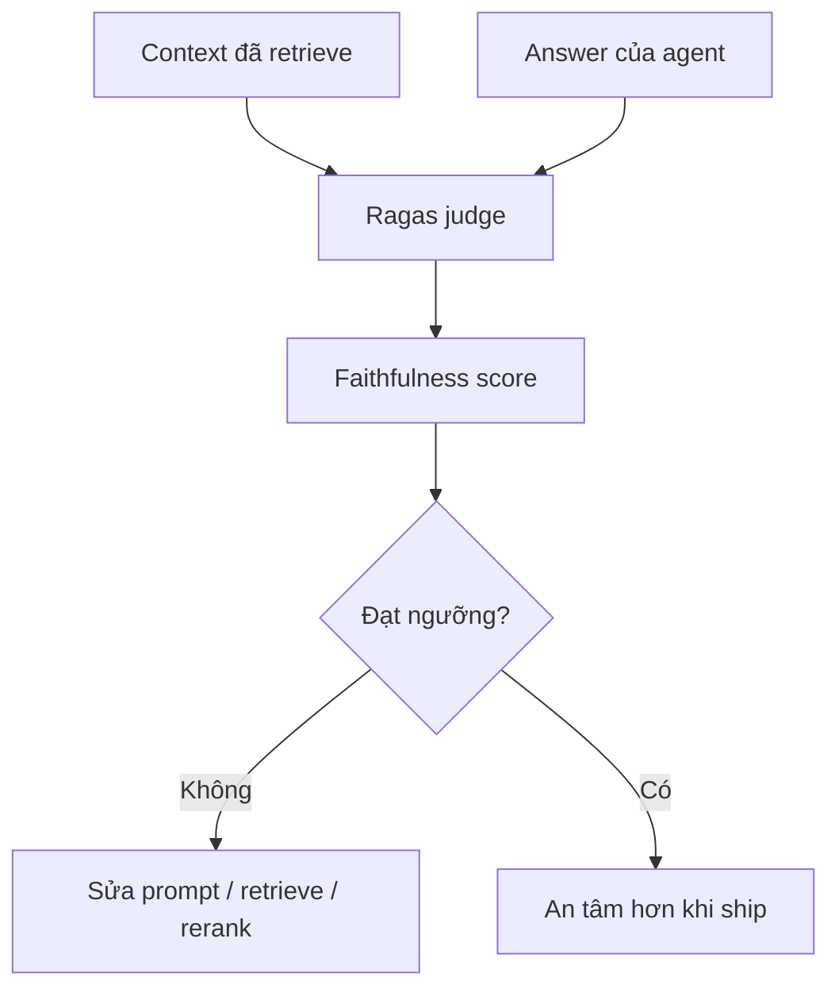

Eval chạy **offline** (`eval/`) — khác với cache/rerank chạy trên đường request.

---

## 11. SoC — tách mối quan tâm

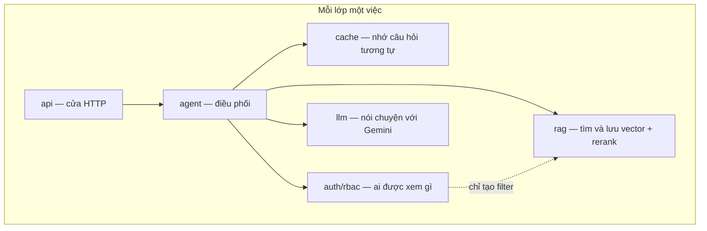

**Câu hỏi kiểm tra:**

- Redis semantic cache viết trong `chat.py`? → **Không** (`services/cache`).  
- Role hard-code trong `retriever.py`? → **Không** (`auth` tạo filter).  
- Chroma cần file PDF lúc query? → **Không** — cần text đã embed.  
- Ragas chạy trên mỗi `/chat`? → **Không bắt buộc** — eval offline.

---

## 12. Bản đồ kiến thức ↔ file trong repo

```mermaid
flowchart TB
    ROOT[Advanced RAG - Dat dai]

    ROOT --> HTTP[HTTP]
    ROOT --> RAG[RAG]
    ROOT --> AG[Agent]
    ROOT --> CACHE[Cache]
    ROOT --> AUTH[Auth]
    ROOT --> LLM[LLM]
    ROOT --> EVAL[Eval]
    ROOT --> CFG[Config]
    ROOT --> DATA[Data]

    HTTP --> H1["api/routes/chat.py"]
    HTTP --> H2["api/routes/health.py"]
    HTTP --> H3["models/schemas.py"]

    RAG --> R1[ingest.py]
    RAG --> R2[retriever.py]
    RAG --> R3[vectorstore.py]
    RAG --> R4[rerank.py]

    AG --> A1[react.py]
    AG --> A2[tools.py]

    CACHE --> C1[semantic.py]
    AUTH --> AU1[rbac.py]

    LLM --> L1[client.py]
    LLM --> L2[prompts.py]

    EVAL --> E1[run_ragas.py]

    CFG --> CF1["core/config.py"]
    CFG --> CF2[".env"]

    DATA --> D1["data/docs"]
    DATA --> D2["data/chroma"]
```

---

## 13. Thực hành gợi ý

1. **Ingest:** bỏ VBPL vào `DATA_DIR`, chạy `ingest_directory()`, xem số chunk (mặc định `audience=public`).  
2. **Retrieve smoke:** hỏi rõ Điều/Khoản, đối chiếu chunk.  
3. **Chat:** `POST /chat` — kiểm tra `sources`; thử header `X-User-Role: citizen|staff|legal_staff`.  
4. **Tool description:** đọc hai description trong `tools.py`.  
5. **Lỗi an toàn:** `execute_tool("get_exchange_rate")` → `[TOOL_ERROR]`, không traceback client.  
6. **Semantic cache (Phase 2):** bật Redis (`docker compose up -d redis`), hỏi trùng / gần nghĩa 2 lần — lần 2 kỳ vọng cache hit (log). Đổi `CORPUS_VERSION` sau re-ingest.  
7. **Rerank (Phase 3):** `python -u scripts/rerank_smoke.py` — so thứ tự trước/sau.  
8. **Ragas:** `uv run --extra eval python -m eval.run_ragas` — đọc Faithfulness.

---

## 14. Thuật ngữ nhanh

| Thuật ngữ | Nghĩa ngắn |
|-----------|------------|
| Hallucination | Model bịa nội dung không có trong nguồn |
| Embedding | Biểu diễn vector của text để so độ tương đồng |
| Chunk overlap | Phần chồng giữa hai chunk để giữ ngữ cảnh biên |
| Function Calling | Model chọn hàm/tool kèm tham số có cấu trúc |
| Observation | Kết quả tool đưa lại vào vòng ReAct |
| Semantic cache | Cache theo độ giống nghĩa + TTL/version |
| Metadata pre-filter | Lọc bằng metadata trong Chroma (RBAC) |
| Reranking | Xếp lại candidates sau retrieve, giữ top-n |
| Faithfulness | Metric Ragas: answer bám context |
| LLM-as-a-judge | Dùng LLM chấm điểm câu trả lời / metric |

---

## 15. Đọc tiếp

1. [architecture.md](./architecture.md) — stack, tối ưu, RBAC, Ragas, Docker, lộ trình  
2. [../README.md](../README.md) — cài đặt và chạy nhanh  
3. Code: `app/services/agent/react.py`, `app/services/agent/tools.py`, `app/services/cache/semantic.py`, `app/services/auth/rbac.py`

---

*Tài liệu học tập — ưu tiên trực quan và khái niệm. Runtime hiện tại là Phase 3 (ReAct + cache + RBAC + rerank; Ragas offline); chi tiết triển khai lấy từ codebase và architecture.md.*
